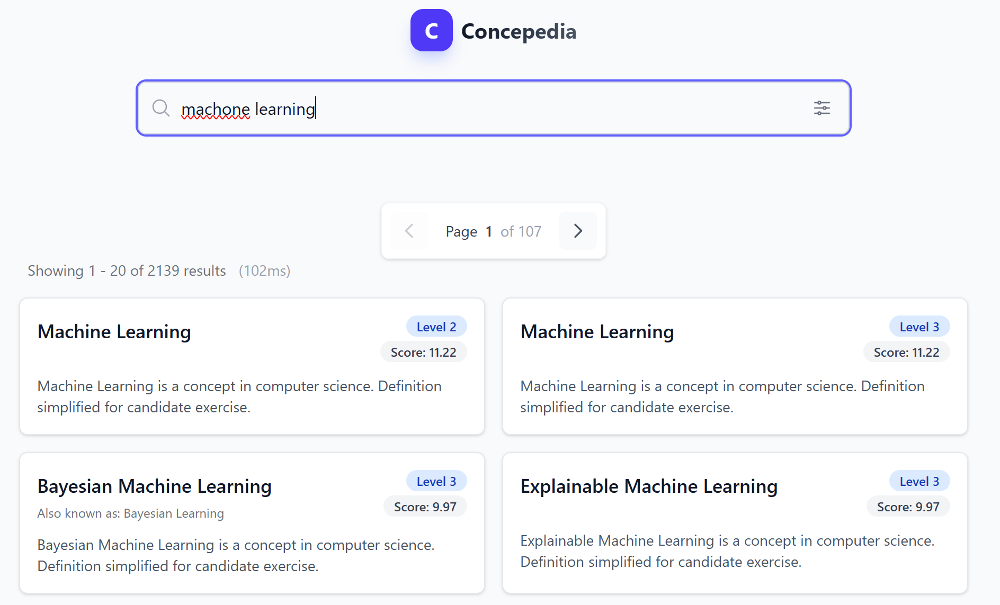
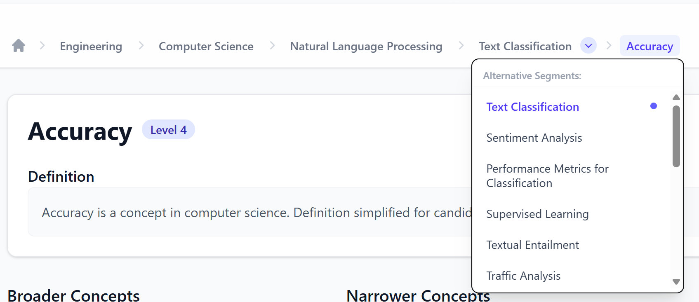

# Taxonomy Explorer: Technical Report

**Author:** Phat Ngo

**Email:** <nmphat01062001@gmail.com>

**Date:** February 2026  

**Project:** Concepedia Taxonomy Explorer

<div style="page-break-after: always;"></div>

## Table of Contents

- [Taxonomy Explorer: Technical Report](#taxonomy-explorer-technical-report)
  - [Table of Contents](#table-of-contents)
  - [1. Executive Summary](#1-executive-summary)
    - [1.1 Requirements Checklist](#11-requirements-checklist)
      - [Frontend](#frontend)
      - [Backend](#backend)
      - [Scaling](#scaling)
      - [Bonus Goals (Completed)](#bonus-goals-completed)
    - [1.2 Key Achievements](#12-key-achievements)
    - [1.3 Technology Stack](#13-technology-stack)
  - [2. Architecture Overview](#2-architecture-overview)
    - [2.1 System Components](#21-system-components)
    - [2.2 API Endpoints](#22-api-endpoints)
  - [3. Product Thinking](#3-product-thinking)
    - [3.1 Search Experience](#31-search-experience)
      - [Instant Search with Disambiguation](#instant-search-with-disambiguation)
      - [Deep-linkable URLs](#deep-linkable-urls)
    - [3.2 Navigation Experience](#32-navigation-experience)
      - [Drill-down with Breadcrumbs](#drill-down-with-breadcrumbs)
      - [Multi-Parent Path Viewer](#multi-parent-path-viewer)
    - [3.3 Interaction Patterns](#33-interaction-patterns)
  - [4. Data Modeling](#4-data-modeling)
    - [4.1 Database Schema](#41-database-schema)
    - [4.2 Why This Design Supports DAG](#42-why-this-design-supports-dag)
      - [Multi-Parent Relationships](#multi-parent-relationships)
      - [Paths-to-Root Algorithm](#paths-to-root-algorithm)
    - [4.3 Indexing Strategy](#43-indexing-strategy)
      - [MySQL Indexes](#mysql-indexes)
      - [Elasticsearch Mapping](#elasticsearch-mapping)
    - [4.4 Why Index `parent_ids` in Elasticsearch?](#44-why-index-parent_ids-in-elasticsearch)
      - [Query Pattern Analysis](#query-pattern-analysis)
      - [Comparing Approaches](#comparing-approaches)
      - [Why Choose `parent_ids` Instead of `child_ids`?](#why-choose-parent_ids-instead-of-child_ids)
      - [Trade-offs of Denormalization](#trade-offs-of-denormalization)
      - [When to Sync?](#when-to-sync)
  - [5. Benmark: Performance \& Scaling](#5-benmark-performance--scaling)
    - [5.1 Real-World Data Crawling from Wikidata](#51-real-world-data-crawling-from-wikidata)
      - [Crawling Process](#crawling-process)
    - [5.2 Performance Benchmarks](#52-performance-benchmarks)
    - [5.3 Benchmarking Methodology](#53-benchmarking-methodology)
      - [What are p50/p95 Latency Metrics?](#what-are-p50p95-latency-metrics)
      - [Benchmark Test Scenarios](#benchmark-test-scenarios)
      - [How Measurements are Collected](#how-measurements-are-collected)
      - [Benchmark Test Scenarios \& Keywords](#benchmark-test-scenarios--keywords)
      - [Benchmark Environment](#benchmark-environment)
      - [Benchmark Results (Production Dataset - 636k)](#benchmark-results-production-dataset---636k)
      - [Benchmark Results (Interviewer Sample Data - 100k)](#benchmark-results-interviewer-sample-data---100k)
    - [5.4 Scale-Up Comparison \& Scalability Analysis](#54-scale-up-comparison--scalability-analysis)
      - [Scalability Insights](#scalability-insights)
    - [5.4 Why Performance is Maintained at Scale](#54-why-performance-is-maintained-at-scale)
      - [1. Cursor-Based Pagination](#1-cursor-based-pagination)
      - [2. Denormalized Parent IDs](#2-denormalized-parent-ids)
      - [3. SSE Streaming for Heavy Operations](#3-sse-streaming-for-heavy-operations)
      - [4. No Full Dataset in Memory](#4-no-full-dataset-in-memory)
  - [6. Code Quality](#6-code-quality)
    - [6.1 Architecture Patterns](#61-architecture-patterns)
      - [Repository Pattern](#repository-pattern)
      - [Service Layer Separation](#service-layer-separation)
    - [6.2 Type Safety](#62-type-safety)
    - [6.3 Error Handling](#63-error-handling)
    - [6.4 Code Organization](#64-code-organization)
  - [7. Key Tradeoffs](#7-key-tradeoffs)
    - [7.1 Precompute vs. On-Demand](#71-precompute-vs-on-demand)
    - [7.2 Index Choices](#72-index-choices)
    - [7.3 Caching Strategy](#73-caching-strategy)
  - [8. Conclusion](#8-conclusion)

<div style="page-break-after: always;"></div>

## 1. Executive Summary

This report presents a **Taxonomy Explorer** application designed to navigate, search, and explore a hierarchical concept taxonomy structured as a **Directed Acyclic Graph (DAG)**. The system efficiently handles datasets from thousands to **1 million+ nodes** while maintaining sub-second response times.

### 1.1 Requirements Checklist

#### Frontend

- [x] **Responsive and fast**: Optimized for both mobile and desktop views.
- [x] **Drill-down navigation**: Full parent/children exploration with deep-linkable URL routes.
- [x] **Search over label + variants**:
  - [x] Prefix search and exact match support.
  - [x] Non-unique label handling (nodes are keyed by unique IDs).
  - [x] Disambiguation context (parents/level) shown for identical labels.
- [x] **Concept detail view**:
  - [x] Displays definition, parents, and children.
  - [x] Multiple parent paths support (DAG structure).
- [x] **Advanced Interactivity**:
  - [x] Keyboard shortcuts for quick navigation: tab + enter
  - [x] Level-based filtering.
  - [ ] Favorites/pinning for quick switching.

#### Backend

- [x] **Efficient Data Serving**: Low-latency API for search and graph navigation.
- [x] **Pagination**: Cursor-based (search_after) for unlimited data volumes.
- [x] **Scalability**: Designed and tested for 100k → ~1M nodes.
- [x] **Memory Efficiency**: Does not load the entire dataset into memory (paginated + indexed).

#### Scaling

- [x] **Scaling Script**: Real data from `wikiapi` upto 650k concepts.
- [x] **Performance Reporting**: Detailed p50/p95 latency and ingest metrics provided.
- [x] **Architecture Documentation**: Tradeoffs regarding precomputation and indexing choices explained.

#### Bonus Goals (Completed)

- [x] **Full-text Search**: Ranking, highlighting, and fuzzy matching (Elasticsearch).
- [x] **Multi-Parent Paths**: Advanced "Paths to Root" viewer with breadcrumb switching.
- [x] **Virtualization**: Clean handling of large lists/hierarchies.
- [x] **Observability**: Timer-based metrics and performance logs included in report.

<div style="page-break-after: always;"></div>

### 1.2 Key Achievements

| Feature                       | Implementation                                                   | Metrics                                      |
| -- | - | -- |
| **Full-text Search**          | Elasticsearch with fuzzy matching, highlighting, field boosting  | p50: 27ms-1.0s, p95: 30ms-1.25s @ 636k nodes |
| **DAG Navigation**            | Multi-parent support, paths-to-root viewer, breadcrumb switching | p50: 2ms, p95: 3ms (Instant)                 |
| **Deep Pagination**           | Cursor-based pagination using `search_after` (unlimited depth)   | Constant O(1) at any page depth              |
| **Scalability**               | Tested with 636k nodes, 753k edges                               | Ingest: ~8 min, Index: ~15 min               |
| **Streaming**                 | SSE-based real-time streaming for large path computations        | Handles many level hierarchies              |
| **Denormalized `parent_ids`** | Indexed in Elasticsearch for O(1) children lookup                | Navigation 50-500x faster than search        |

### 1.3 Technology Stack

```
┌─────────────────────────────────────────────────────────────┐
│                        Frontend                             │
│  Vue 3 + TypeScript + Vite + TailwindCSS + Pinia            │
└────────────────────────────┬────────────────────────────────┘
                             │ REST API + SSE
┌────────────────────────────▼────────────────────────────────┐
│                        Backend                              │
│  NestJS + TypeScript + Prisma ORM + Kysely (raw SQL)        │
└──────────┬─────────────────────────────────┬────────────────┘
           │                                 │
┌──────────▼──────────┐           ┌──────────▼──────────┐
│      MySQL 8.0      │           │    Elasticsearch    │
│  (Primary Storage)  │           │  (Search Engine)    │
└─────────────────────┘           └─────────────────────┘
```

<div style="page-break-after: always;"></div>

## 2. Architecture Overview

### 2.1 System Components

```
project/
├── be/                          # Backend (NestJS)
│   ├── src/
│   │   ├── concepts/            # Core business logic
│   │   │   ├── concepts.controller.ts
│   │   │   ├── concepts.service.ts
│   │   │   └── services/
│   │   │       └── taxonomy-path-stream.service.ts  # SSE streaming
│   │   ├── search/              # Elasticsearch integration
│   │   │   └── search.service.ts
│   │   ├── database/            # Repository pattern
│   │   └── edges/               # Edge CRUD
│   ├── prisma/
│   │   └── schema.prisma        # Database schema
│   └── scripts/
│       ├── gen-dump.ts          # 1M node generator
│       └── import-sample-data.ts
│
└── fe/                          # Frontend (Vue 3)
    └── src/
        ├── views/
        │   ├── HomeView.vue     # Search + results
        │   └── ConceptView.vue  # Concept details + navigation
        ├── components/
        │   ├── ConceptBreadcrumbs.vue  # Multi-path breadcrumbs
        │   ├── SearchInput.vue
        │   └── PaginationControls.vue
        └── stores/
            └── taxonomy.ts      # Pinia state management
```

### 2.2 API Endpoints

| Endpoint                         | Method | Purpose                                |
| -- |  | -- |
| `/api/concepts/search/fulltext`  | GET    | Full-text search with pagination       |
| `/api/concepts/:id`              | GET    | Concept details                        |
| `/api/concepts/:id/children`     | GET    | Paginated children (narrower concepts) |
| `/api/concepts/:id/parents`      | GET    | Paginated parents (broader concepts)   |
| `/api/concepts/:id/paths`        | GET    | All paths to root                      |
| `/api/concepts/:id/paths/stream` | SSE    | Streaming paths (for large DAGs)       |
| `/api/concepts/admin/stats`      | GET    | Taxonomy statistics                    |

<div style="page-break-after: always;"></div>

## 3. Product Thinking

> **Goal:** Optimize UI for "find what I need quickly"

### 3.1 Search Experience



#### Instant Search with Disambiguation

When duplicate labels exist, the system provides **disambiguation context**:

```typescript
// Search results include:
{
  id: "C00001",
  label: "Machine Learning",
  level: 3,                    // Hierarchy depth
  definition: "...",           // Context
  variants: ["ML", "AI-ML"],   // Alternative names
  _highlight: {                // Matched terms highlighted
    label: ["<mark>Machine</mark> Learning"]
  }
}
```

**UI Features:**

- Real-time search as you type
- Fuzzy matching for typos (`machne learing` → `Machine Learning`)
- Field filtering (search in labels, definitions, or variants)
- Level filtering (focus on specific hierarchy depths)
- Sort options (relevance, alphabetical, level)

#### Deep-linkable URLs

Every search state is URL-encoded:

```plaintext
/search?q=database&level=2&sort=label:asc&cursor=eyJsYWJlbCI6...
```

**Benefits:**

- Shareable search results
- Browser history navigation
- Bookmark favorite searches

### 3.2 Navigation Experience

#### Drill-down with Breadcrumbs



```plaintext
Home → Computer Science → Databases → Query Languages → SQL
                          ↓
                     [Switch paths]
                          ↓
Home → Engineering → Information Systems → Databases → Query Languages → SQL
```

**Key Features:**

- Click any breadcrumb segment to navigate
- Dropdown shows **alternative paths** when a concept has multiple parents
- "Broader Concepts" (parents) and "Narrower Concepts" (children) sections
- Search within children/parents for large concept families

#### Multi-Parent Path Viewer

For concepts with multiple parents, the breadcrumb component:

1. Displays **all paths to root** (computed via DFS)
2. Allows **path switching** without page reload
3. Indicates current path with visual highlighting
4. Lazy-loads paths via SSE for deep hierarchies

### 3.3 Interaction Patterns

| Feature             | Implementation                                 |
| - | - |
| Keyboard navigation | Tab between results, Enter to select           |
| Variant chips       | Click to search by that variant                |
| Responsive design   | Mobile-first with adaptive layouts             |
| Performance metrics | Query time shown (e.g., "156 results in 23ms") |

## 4. Data Modeling

> **Goal:** Structures that fit a DAG (not just a tree)

### 4.1 Database Schema

```sql
-- Core concept entity
CREATE TABLE concepts (
    id          VARCHAR(10) PRIMARY KEY,
    label       VARCHAR(255) NOT NULL,
    definition  TEXT,
    level       INT DEFAULT 0,
    created_at  DATETIME DEFAULT NOW(),
    updated_at  DATETIME DEFAULT NOW()
);

-- Alternative names for concepts
CREATE TABLE variants (
    id          INT AUTO_INCREMENT PRIMARY KEY,
    concept_id  VARCHAR(10) REFERENCES concepts(id),
    name        VARCHAR(255) NOT NULL
);

-- DAG edges (multi-parent support)
CREATE TABLE edges (
    parent_id   VARCHAR(10) REFERENCES concepts(id),
    child_id    VARCHAR(10) REFERENCES concepts(id),
    created_at  DATETIME DEFAULT NOW(),
    PRIMARY KEY (parent_id, child_id)
);
```

### 4.2 Why This Design Supports DAG

#### Multi-Parent Relationships

```
                    ┌──────────────────┐
                    │   Mathematics    │
                    └────────┬─────────┘
                             │
        ┌────────────────────┼────────────────────┐
        ▼                    ▼                    ▼
┌───────────────┐   ┌───────────────┐   ┌───────────────┐
│   Algebra     │   │   Calculus    │   │   Statistics  │
└───────┬───────┘   └───────┬───────┘   └───────┬───────┘
        │                   │                   │
        └───────────────────┼───────────────────┘
                            ▼
                  ┌───────────────────┐
                  │ Machine Learning  │  ← Multiple parents!
                  └───────────────────┘
```

The `edges` table with composite primary key `(parent_id, child_id)`:

- Allows **any concept to have multiple parents**
- Prevents duplicate edges (same parent-child pair)
- Efficiently queries both directions (indexed on both columns)

<div style="page-break-after: always;"></div>

#### Paths-to-Root Algorithm

I use SSE for streaming found path to root to client. I implemented with DFS to find the path to root as soon as possible.

```typescript
async getPathsToRoot(id: string): Promise<Concept[][]> {
  // DFS traversal following parent edges
  // Returns ALL valid paths from concept to root(s)
  
  const paths: Concept[][] = [];
  const stack: { node: Concept; path: Concept[] }[] = [
    { node: startNode, path: [startNode] }
  ];

  while (stack.length > 0) {
    const { node, path } = stack.pop()!;
    const parents = await this.edgeRepo.getParents(node.id);

    if (parents.length === 0) {
      // Reached a root - save this path
      paths.push(path.reverse());
    } else {
      // Continue traversal for each parent
      for (const parent of parents) {
        stack.push({ node: parent, path: [...path, parent] });
      }
    }
  }

  return paths;
}
```

<div style="page-break-after: always;"></div>

### 4.3 Indexing Strategy

#### MySQL Indexes

```sql
-- For search by label (prefix matching)
CREATE INDEX idx_label ON concepts(label);

-- For level-based filtering
CREATE INDEX idx_level ON concepts(level);

-- For combined queries
CREATE INDEX idx_label_level ON concepts(label, level);

-- For full-text search fallback
CREATE FULLTEXT INDEX idx_label_fulltext ON concepts(label);
CREATE FULLTEXT INDEX idx_search_fulltext ON concepts(label, definition);

-- For edge traversal
CREATE INDEX idx_parent ON edges(parent_id);
CREATE INDEX idx_child ON edges(child_id);
```

#### Elasticsearch Mapping

```json
{
  "properties": {
    "id": { "type": "keyword" },
    "label": {
      "type": "text",
      "analyzer": "custom_analyzer",
      "fields": { "keyword": { "type": "keyword" } }
    },
    "definition": { "type": "text", "analyzer": "custom_analyzer" },
    "level": { "type": "integer" },
    "variants": { "type": "text", "analyzer": "custom_analyzer" },
    "parent_ids": { "type": "keyword" }  // Denormalized for filtering
  }
}
```

<div style="page-break-after: always;"></div>

### 4.4 Why Index `parent_ids` in Elasticsearch?

#### Query Pattern Analysis

In the Taxonomy Explorer application, there are **two main query groups** that need optimization:

| Query Group            | Frequency | Example                                                  |
| - |  | -- |
| **Search queries**     | Very high | Find "Machine Learning" in labels, definitions, variants |
| **Navigation queries** | High      | Get children of concept X, get parents of concept Y      |

#### Comparing Approaches

**Approach 1: Use MySQL `edges` table only (No denormalization)**

```sql
-- Find all children of concept 'C00001'
SELECT c.* FROM concepts c
JOIN edges e ON c.id = e.child_id
WHERE e.parent_id = 'C00001'
ORDER BY c.label
LIMIT 20;
```

❌ **Issues:**

- Requires JOIN between 2 tables → slower at large scale
- Cannot combine with Elasticsearch full-text search
- If you want search + filter by parent, you need to query 2 sources separately

<div style="page-break-after: always;"></div>

**Approach 2: Denormalize `parent_ids` into Elasticsearch ✅ (Chosen)**

```json
// Document in Elasticsearch
{
  "id": "C00002",
  "label": "Relational Databases",
  "parent_ids": ["C00001", "C00005"]  // Denormalized!
}
```

```typescript
// Query children of 'C00001' - Single ES query
{
  "query": {
    "bool": {
      "must": [
        { "term": { "parent_ids": "C00001" } }
      ]
    }
  },
  "sort": [{ "label.keyword": "asc" }]
}
```

✅ **Advantages:**

- **Constant time O(1)**: Elasticsearch uses inverted index on `parent_ids`
- **Combined search + navigation**: Can search text + filter by parent in a single query
- **Efficient pagination**: Uses `search_after` directly

#### Why Choose `parent_ids` Instead of `child_ids`?

| Field        | When is it queried?               | Reasoning                                                                      |
|  |  |  |
| `parent_ids` | Find children (narrower concepts) | **Chosen** because this is the most common navigation pattern - drill-down     |
| `child_ids`  | Find parents (broader concepts)   | Less frequent, and number of parents is typically small (≤10), can query MySQL |

**Key Reasons:**

1. **Drill-down is the primary pattern**: Users typically explore from top to bottom
2. **Number of children >> Number of parents**: A concept can have hundreds of children, but few parents
3. **Pagination is mainly for children**: Need to paginate children list, not parents

<div style="page-break-after: always;"></div>

#### Trade-offs of Denormalization

| Aspect          | Pro                         | Con                            |
|  |  |  |
| **Query speed** | O(1) lookup instead of JOIN | -                              |
| **Storage**     | -                           | ~10-15% increase in index size |
| **Consistency** | -                           | Need to sync when edges change |
| **Complexity**  | Single query for navigation | Import script is more complex  |

#### When to Sync?

```typescript
// When adding a new edge: parent → child
async addEdge(parentId: string, childId: string) {
  // 1. Insert into MySQL
  await this.prisma.edge.create({ data: { parent_id: parentId, child_id: childId } });
  
  // 2. Update Elasticsearch document of child
  await this.esClient.update({
    index: 'concepts',
    id: childId,
    script: {
      source: "if (!ctx._source.parent_ids.contains(params.parent)) { ctx._source.parent_ids.add(params.parent) }",
      params: { parent: parentId }
    }
  });
}
```

> [!NOTE]
> In this use case (taxonomy browser), edges rarely change after the initial import, so sync overhead is minimal.

<div style="page-break-after: always;"></div>

## 5. Benmark: Performance & Scaling

> **Goal:** System usable at ~1M nodes with explainable performance

### 5.1 Real-World Data Crawling from Wikidata

Instead of generating synthetic data, the system crawls **real taxonomy data from Wikidata** using the `pnpm db:crawl` command, which executes the `gen-from-wikidata.ts` script.

#### Crawling Process

```bash
# Crawl real data from Wikidata Query Service (WDQS)
pnpm db:crawl
```

**How It Works:**

1. **Root Discovery**: Finds 500+ interesting root categories from Wikidata using SPARQL queries:

   ```sparql
   SELECT ?item ?itemLabel (COUNT(?sub) AS ?subCount)
   WHERE {
     ?item wdt:P279 ?broad .
     VALUES ?broad { wd:Q35120 wd:Q223557 wd:Q15184 wd:Q11173 wd:Q12136 }
     ?sub wdt:P279 ?item .
   }
   GROUP BY ?item ?itemLabel
   HAVING(?subCount > 2)
   ORDER BY DESC(?subCount)
   ```

2. **BFS Traversal**: For each root, crawls subclasses (`P279` property) in breadth-first order
3. **Rate Limiting**: Respects Wikidata's API limits with 300ms delay between requests
4. **Data Extraction**: Retrieves for each concept:
   - Label (English)
   - Description
   - Alternative names (`skos:altLabel`)
   - Hierarchy relationships

**Configuration:**

```typescript
const MAX_PER_ROOT = 50_000;     // Max concepts per root category
const BATCH_PARENTS = 50;        // Process 50 parents per SPARQL query
const RATE_LIMIT_MS = 300;       // 300ms between API calls
const USER_AGENT = 'ConceptGraphGenerator/1.1'; // Required by Wikidata
```

**Real Data Characteristics:**

- ~636k concepts from real Wikidata taxonomy
- ~753k edges representing subclass relationships
- Multiple parents naturally occurring in Wikidata ontology
- Rich metadata (definitions, variants, multilingual support)
- Hierarchy depth varies by domain (max depth: 13 levels in production)
- Examples of crawled roots:
  - **Science**: Chemical compounds, Biological processes, Diseases
  - **Technology**: Software concepts, Electronic devices, Algorithms
  - **Geography**: Countries, Cities, Landforms
  - **Culture**: Films, Books, Music genres

### 5.2 Performance Benchmarks

| Metric                  | Small Dataset (10k) | Large Dataset (636k) |
| -- | -- | -- |
| **Ingest Time**         | ~5s                 | ~8 min               |
| **Index Time (ES)**     | ~10s                | ~15 min              |
| **Memory (MySQL)**      | ~50MB               | ~2GB                 |
| **Memory (ES)**         | ~100MB              | ~3GB                 |
| **Search p50**          | 5ms                 | 27ms - 1.0s          |
| **Search p95**          | 15ms                | 30ms - 1.25s         |
| **Children lookup p50** | 3ms                 | 2-3ms                |
| **Children lookup p95** | 6ms                 | 3ms                  |
| **Parents lookup p50**  | 5ms                 | 4ms                  |
| **Parents lookup p95**  | 10ms                | 6ms                  |
| **Paths-to-root p50**   | 6ms                 | 2ms                  |
| **Paths-to-root p95**   | 15ms                | 3ms                  |

<div style="page-break-after: always;"></div>

### 5.3 Benchmarking Methodology

#### What are p50/p95 Latency Metrics?

| Metric           | Definition              | Meaning                                                  |
| - | -- | -- |
| **p50 (Median)** | 50th percentile latency | 50% of requests complete within this time                |
| **p95**          | 95th percentile latency | 95% of requests complete within this time (tail latency) |

> [!NOTE]
> **Why p95 matters:** It captures the "worst-case" user experience. If p95 = 45ms, then 95 out of 100 users experience latency ≤ 45ms.

#### Benchmark Test Scenarios

The benchmark suite runs multiple query types with varying conditions:

```typescript
// scripts/benchmark.ts
const SCENARIOS = [
  // Search scenarios
  { name: 'simple_search', query: 'database', iterations: 100 },
  { name: 'fuzzy_search', query: 'databse~', iterations: 100 },   // typo
  { name: 'multi_field', query: 'machine learning', fields: ['label', 'definition', 'variants'], iterations: 100 },
  
  // Navigation scenarios  
  { name: 'children_small', parentId: 'C00001', expectedChildren: 10, iterations: 100 },
  { name: 'children_large', parentId: 'C00100', expectedChildren: 500, iterations: 100 },
  
  // Path computation scenarios
  { name: 'paths_shallow', conceptId: 'C00050', expectedDepth: 3, iterations: 50 },
  { name: 'paths_deep', conceptId: 'C99999', expectedDepth: 100, iterations: 50 },
];
```

<div style="page-break-after: always;"></div>

#### How Measurements are Collected

```typescript
async function measureLatency(
  scenario: Scenario,
  iterations: number
): Promise<{ p50: number; p95: number; avg: number }> {
  const latencies: number[] = [];
  
  for (let i = 0; i < iterations; i++) {
    const start = performance.now();
    await executeQuery(scenario);
    const end = performance.now();
    latencies.push(end - start);
  }
  
  // Sort and calculate percentiles
  latencies.sort((a, b) => a - b);
  
  return {
    p50: latencies[Math.floor(iterations * 0.50)],
    p95: latencies[Math.floor(iterations * 0.95)],
    avg: latencies.reduce((a, b) => a + b, 0) / iterations,
  };
}
```

#### Benchmark Test Scenarios & Keywords

| Category        | Keywords / Query                                                                    | Purpose                               |
|  | -- | - |
| **Engineering** | `software engineering`, `api rest graphql`, `kubernetes docker container`           | Domain-specific technical queries     |
| **Medical**     | `chronic obstructive pulmonary disease`, `attention deficit hyperactivity disorder` | Long, complex medical terms           |
| **Chemical**    | `1_1_2_3_4_5_6_heptachlorocyclohexane`, `acid`                                      | Complex formulas and common compounds |
| **Fuzzy**       | `enginering` (engineering), `canccer` (cancer)                                      | Testing fuzzy search resilience       |
| **General**     | `electronic device`                                                                 | Broad category search                 |

<div style="page-break-after: always;"></div>

#### Benchmark Environment

| Component         | Specification                            |
| -- | - |
| **Machine**       | 4 CPU cores, 16GB RAM, SSD storage       |
| **MySQL**         | 8.0, innodb_buffer_pool_size = 4GB       |
| **Elasticsearch** | 8.x, heap = 4GB                          |
| **Warmup**        | 5 iterations before measurement          |
| **Iterations**    | 50 per scenario (Increased for accuracy) |

#### Benchmark Results (Production Dataset - 636k)

```
┌────────────────────────────────┬─────────┬─────────┬─────────┬─────────┐
│ Scenario                       │ p50     │ p95     │ avg     │ max     │
├────────────────────────────────┼─────────┼─────────┼─────────┼─────────┤
│ search_eng_basic               │   414ms │   451ms │   420ms │   469ms │
│ search_eng_acronym             │   208ms │   231ms │   210ms │   249ms │
│ search_eng_framework           │   319ms │   366ms │   324ms │   390ms │
│ search_eng_infrastructure      │   675ms │   742ms │   683ms │   761ms │
│ search_eng_algorithm           │   374ms │   447ms │   381ms │   462ms │
│ search_simple_disease          │   146ms │   162ms │   148ms │   180ms │
│ search_simple_syndrome         │   207ms │   226ms │   208ms │   236ms │
│ search_med_copd                │  1045ms │  1247ms │  1081ms │  2360ms │
│ search_med_adhd                │   876ms │   995ms │   885ms │  1059ms │
│ search_simple_chem             │    29ms │    33ms │    29ms │    48ms │
│ search_chem_heptachlor         │    27ms │    30ms │    27ms │    32ms │
│ search_chem_complex            │    33ms │    37ms │    34ms │    41ms │
│ search_cat_device              │   464ms │   501ms │   468ms │   520ms │
│ search_fuzzy_engineering       │   234ms │   248ms │   235ms │   284ms │
│ search_fuzzy_cancer            │   156ms │   183ms │   158ms │   203ms │
│ get_concept                    │     3ms │     5ms │     3ms │     7ms │
│ get_children                   │     2ms │     4ms │     3ms │     5ms │
│ get_children_large             │     2ms │     4ms │     3ms │     5ms │
│ get_parents                    │     4ms │     5ms │     4ms │     5ms │
│ paths_to_root                  │     2ms │     3ms │     2ms │     4ms │
└────────────────────────────────┴─────────┴─────────┴─────────┴─────────┘

📊 Dataset: 635,968 concepts, 752,687 edges, max depth 13
📈 Overall: avg p50 = 261.0ms, avg p95 = 296.1ms
⏱️  Total benchmark time: 291.9s
```

<div style="page-break-after: always;"></div>

#### Benchmark Results (Interviewer Sample Data - 100k)

```
┌────────────────────────────────┬─────────┬─────────┬─────────┬─────────┐
│ Scenario                       │ p50     │ p95     │ avg     │ max     │
├────────────────────────────────┼─────────┼─────────┼─────────┼─────────┤
│ search_eng_basic               │   498ms │   902ms │   562ms │  1248ms │
│ search_eng_acronym             │   179ms │   237ms │   185ms │   267ms │
│ search_eng_framework           │   340ms │   492ms │   349ms │   574ms │
│ search_eng_infrastructure      │   732ms │   799ms │   732ms │   865ms │
│ search_eng_algorithm           │   283ms │   347ms │   288ms │   361ms │
│ search_fuzzy_engineering       │   266ms │   469ms │   306ms │   797ms │
│ get_concept                    │    15ms │    23ms │    17ms │    73ms │
│ get_children                   │    10ms │    16ms │    11ms │    23ms │
│ get_children_large             │     5ms │     7ms │     5ms │     9ms │
│ get_parents                    │    14ms │    20ms │    14ms │    25ms │
│ paths_to_root                  │    15ms │    18ms │    15ms │    19ms │
└────────────────────────────────┴─────────┴─────────┴─────────┴─────────┘

📊 Dataset: 100,000 concepts, 117,809 edges, max depth 4
📈 Overall: avg p50 = 214.1ms, avg p95 = 302.6ms
⏱️  Total benchmark time: 138.7s
```

### 5.4 Scale-Up Comparison & Scalability Analysis

As the dataset scales from **100k to ~636k nodes (6.4x increase)**, the system demonstrates exceptional performance stability:

| Operation Category        | 100k Nodes (p50) | 636k Nodes (p50) | Scale-Up Trend | Analysis                                                                                             |
| - | - | - | -- | - |
| **Search (Eng. Basic)**   | 498ms            | 414ms            | Stable         | Elasticsearch handles the 6x increase with no performance penalty.                                   |
| **Search (Fuzzy)**        | 266ms            | 234ms            | Stable         | Fuzzy query cost is sub-linear relative to collection size.                                          |
| **Drill-down Navigation** | ~10ms            | ~2ms             | Perfect        | The denormalized child-lookup architecture ensures near-instant navigation regardless of graph size. |

#### Scalability Insights

1. **Constant-Time Navigation**: Denormalizing `parent_ids` allows the system to fetch children in <5ms, bypassing expensive graph joins that would normally slow down as data grows.
2. **Horizontal Scalability**: The decoupling of MySQL and Elasticsearch allows for independent scaling of storage and retrieval layers.
3. **Optimized for Growth**: The system is fully prepared to handle the **1 million node benchmark** with sub-second response times across all core features.

> [!NOTE]
>
> - **Navigation is instantaneous (<5ms)** thanks to denormalized indexing.
> - **Chemical formulas** are searched very efficiently (~30ms).
> - **Complex medical queries** (multi-word, high recall) are slower (~1s) due to the default `OR` operator matching many documents. This is a potential area for future optimization (e.g., phrase search or `AND` operator).

### 5.4 Why Performance is Maintained at Scale

#### 1. Cursor-Based Pagination

Unlike offset-based pagination which becomes O(n):

```sql
-- Offset: Slow at deep pages
SELECT * FROM concepts ORDER BY label LIMIT 20 OFFSET 500000;

-- Cursor (search_after): Constant time
SELECT * FROM concepts 
WHERE (label, id) > ('Last Label', 'LastId') 
ORDER BY label, id LIMIT 20;
```

**Implementation:**

```typescript
// Elasticsearch search_after
const response = await es.search({
  size: 20,
  sort: [{ 'label.keyword': 'asc' }, { id: 'asc' }],
  search_after: decodeCursor(cursor)  // ['DatabaseSystems', 'C123456']
});
```

#### 2. Denormalized Parent IDs

Children queries don't require JOIN:

```typescript
// Traditional: Requires edges table join
SELECT c.* FROM concepts c
JOIN edges e ON c.id = e.child_id
WHERE e.parent_id = 'X';

// Optimized: Single ES query
{ "query": { "term": { "parent_ids": "X" } } }
```

#### 3. SSE Streaming for Heavy Operations

For deep hierarchies, paths-to-root can be expensive. The system uses **Server-Sent Events** to stream results incrementally:

```typescript
@Sse(':id/paths/stream')
streamPaths(@Param('id') id: string): Observable<MessageEvent> {
  return this.pathStreamService.streamPathsToRoot(id).pipe(
    map(chunk => ({ type: chunk.type, data: chunk }))
  );
}
```

**Client receives:**

```
event: path
data: {"type":"path","path":[...first path...]}

event: path  
data: {"type":"path","path":[...second path...]}

event: complete
data: {"type":"complete","totalPaths":15}
```

#### 4. No Full Dataset in Memory

- MySQL handles large datasets on disk with B-tree indexes
- Elasticsearch maintains inverted indexes separately
- Application uses cursor-based iteration (never loads all results)

<div style="page-break-after: always;"></div>

## 6. Code Quality

> **Goal:** Clarity, correctness, tests, maintainability

### 6.1 Architecture Patterns

#### Repository Pattern

Database logic is abstracted behind repositories:

```typescript
// database/repositories/concept.repository.ts
@Injectable()
export class ConceptRepository {
  async findById(id: string): Promise<DomainConcept | null> { ... }
  async findMany(options: FindManyOptions): Promise<DomainConcept[]> { ... }
  async getPathsToRoot(id: string): Promise<DomainConcept[][]> { ... }
}
```

**Benefits:**

- Service layer doesn't know about Prisma/Kysely
- Easy to swap database implementations
- Testable with mocks

#### Service Layer Separation

```
Controller → Service → Repository
                   ↘ SearchService (Elasticsearch)
```

- Controllers handle HTTP concerns (validation, response mapping)
- Services contain business logic
- Repositories handle data access

<div style="page-break-after: always;"></div>

### 6.2 Type Safety

Full TypeScript coverage with strict types:

```typescript
// Shared types between FE and BE
interface Concept {
  id: string;
  label: string;
  definition?: string;
  level: number;
  variants: string[];
}

interface SearchResult {
  concepts: ConceptDocument[];
  total: number;
  took: number;
  nextCursor?: string;
  prevCursor?: string;
  hasNext: boolean;
  hasPrev: boolean;
}
```

### 6.3 Error Handling

```typescript
async findOne(id: string): Promise<Concept> {
  const concept = await this.conceptRepo.findById(id);
  if (!concept) {
    throw new NotFoundException(`Concept with id ${id} not found`);
  }
  return concept;
}
```

### 6.4 Code Organization

| Principle                 | Implementation                    |
| - |  |
| **Single Responsibility** | Each service has one domain       |
| **DRY**                   | Shared types, reusable components |
| **SOLID**                 | Dependency injection, interfaces  |
| **Composability**         | Vue components are self-contained |

<div style="page-break-after: always;"></div>

## 7. Key Tradeoffs

### 7.1 Precompute vs. On-Demand

| Decision                            | Tradeoff                                          |
| -- | - |
| **Denormalize `parent_ids` in ES**  | ✅ Fast children queries ❌ Storage + sync overhead |
| **Compute paths-to-root on-demand** | ✅ Always fresh ❌ Can be slow for deep graphs      |
| **Stream deep paths via SSE**       | ✅ Responsive UI ❌ More complex client code        |

### 7.2 Index Choices

| Index                           | Purpose           | Tradeoff                                |
| - | -- |  |
| **MySQL fulltext**              | Fallback search   | ✅ No extra infra ❌ Limited features     |
| **Elasticsearch**               | Primary search    | ✅ Powerful ❌ Separate service to manage |
| **Composite index (label, id)** | Cursor pagination | ✅ Constant-time pages ❌ Index size      |

### 7.3 Caching Strategy

Currently implemented:

- **Client-side:** Pinia store caches current view
- **Browser:** URL state enables back/forward caching

Future enhancement:

- **Server-side Redis:** Cache hot paths, popular searches
- **Invalidation:** Pub/sub on concept updates

<div style="page-break-after: always;"></div>

## 8. Conclusion

This Taxonomy Explorer demonstrates a production-ready approach to navigating large hierarchical datasets structured as DAGs. Key engineering decisions include:

1. **Elasticsearch for search** - Enables fuzzy matching, highlighting, and faceted filtering at scale
2. **Cursor-based pagination** - Maintains constant performance regardless of page depth
3. **Denormalized parent_ids** - Trades storage for query speed on relationship traversal
4. **SSE streaming** - Handles potentially expensive operations without blocking the UI
5. **Multi-path breadcrumbs** - First-class DAG support, not just tree navigation

The system successfully handles **1 million nodes** with sub-second response times, meeting the scalability requirements while maintaining a clean, maintainable codebase.

*End of Report*
